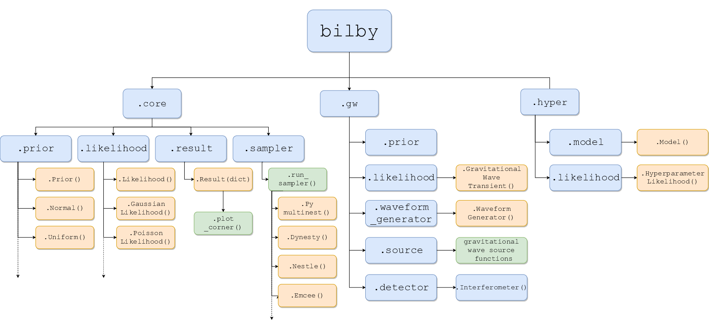
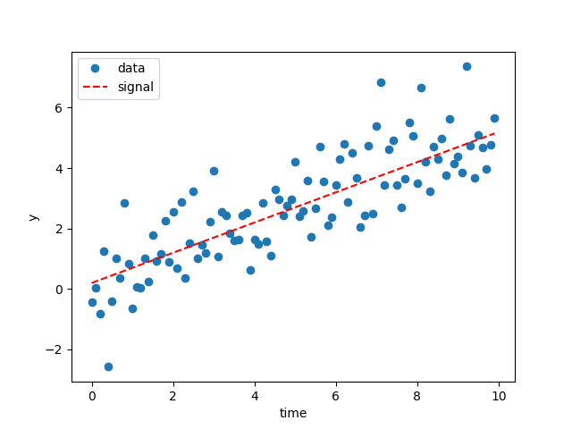
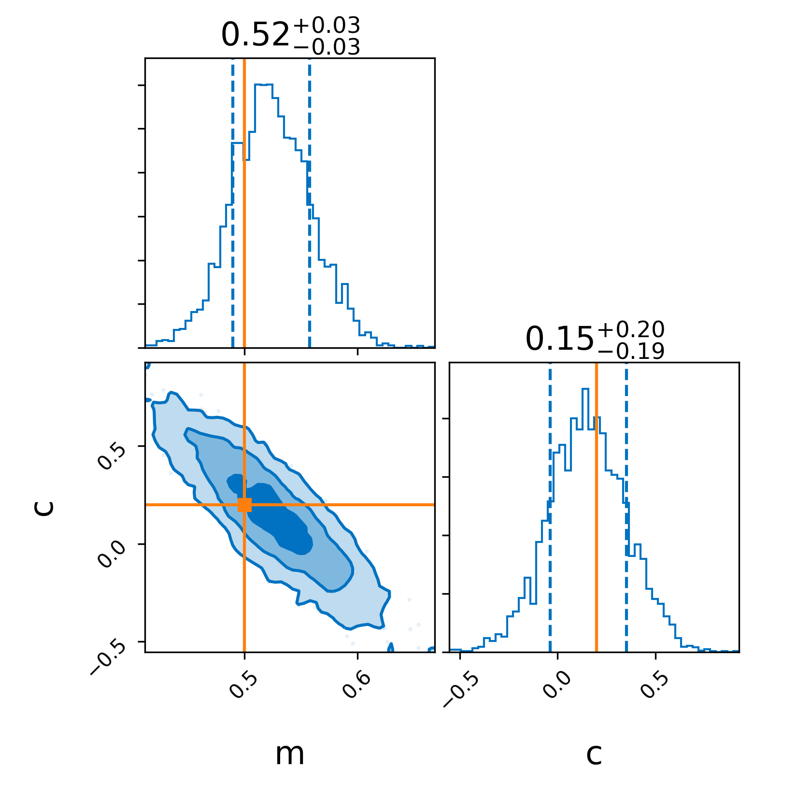

Bilby
=================================

Bilby是一款用户友好的贝叶斯推断库，它提供了一个界面来执行参数估计。它主要用于在引力波干涉仪的数据中致密双星并合的引力波事件的推断，但是也可以用于更多一般的问题。

.. toctree::
   :maxdepth: 2

----------------------------
Bilby的安装
----------------------------

详细安装方法可参考 `官方文档 <https://lscsoft.docs.ligo.org/bilby/installation.html#>`_

一般情况下使用pip安装比较方便。即

.. code-block:: console

          $ pip install bilby

这样就可以满足利用bilby解决一般推断问题的要求。包括默认的采样器(sampler) dynesty. 其他采样器可以利用pip或者其他合适的方法。

而为了使用`bilby.gw`模块进行引力波推断，需要额外执行安装命令。

.. code-block:: console

          $ pip install gwpy lalsuite

也可以从源代码编译安装bilby，具体可参考 `官方文档 <https://lscsoft.docs.ligo.org/bilby/installation.html#>`_

----------------------------
Bilby代码概览
----------------------------

下面是Bilby中不同包和模块的依赖关系的流程图。

----------------------------
参数估计基础
----------------------------

此部分参见 `官方文档 <https://lscsoft.docs.ligo.org/bilby/basics-of-parameter-estimation.html#final-thoughts>`_

主要介绍了参数估计基础和在bilby中的实现。

首先，考虑有离散数据 :math:`\{y_0,
y_1,\ldots, y_n\}` 在时刻 :math:`\{t_0, t_1, \ldots, t_n\}` 采样。此外，我们知道这个数据由一个过程生成，这个过程可由一个线性函数建模，形式为 :math:`y(t) = m t + c`。我们把这个模型称作  :math:`H`. 给定一组数据，我们怎样计算得到系数 :math:`m` 和 :math:`c`?

这是一个被研究得很透彻的问题， 称为 `线性回归` 。已经有很多方法用来估计系数(例如最小二乘估计)。在这里我们将描述一种使用嵌套采样(nested sampling)的贝叶斯方法来解决这个问题。可以展示 :code:`bilby` 的一些基本特性

数学
----------------------------

给定数据下，模型参数的后验分布由下式给出

.. math::

   P(m, c| \{y_i, t_i\}, H) \propto P(\{y_i, t_i\}| m, c, H) \times P(m, c| H)\,.

右边的第一项是 *似然函数* (*likelihood*)，第二项是 *先验分布* (*prior*)。 

在模型 :math:`H` 中, 给定一个系数值，数据点 :math:`y_i, t_i` 的似然函数将被定义为高斯分布，如下所示：

.. math::

   P(y_i, t_i| m, c, H) = \frac{1}{\sqrt{2\pi\sigma^2}}
                         \mathrm{exp}\left(\frac{-(y_i - (t_i m + c))^2}{2\sigma^2}\right) \,.

接下来，我们假定所有的数据点都是独立的，因此，

.. math::

   P(\{y_i, t_i\}| m, c, H) = \prod_{i=1}^n P(y_i, t_i| m, c, H) \,.

在使用计算机解决问题时，采用 *对数似然函数* 往往比较方便. 实际上， 一个 :code:`bilby` 的 *likelihood* 对象必须有一个`log_likelihood()` 方法。对于正态分布， *n* 个数据点的对数似然函数是

.. math::

   \log(P(\{y_i, t_i\}| m, c, H)) = -\frac{1}{2}\left[
       \sum_{i=1}^n \left(\frac{(y_i - (t_i x + c))}{\sigma}\right)^2
       + n\log\left(2\pi\sigma^2\right)\right] \,.

最终，我们需要指定一个 *先验分布* ( *prior* )。在这个例子中我们使用了不相关的均匀分布

.. math::

  P(m, c| H) = P(m| H) \times P(c| H) = \textrm{Unif}(0, 5) \times \textrm{Unif}(-2, 2)\,.

先验分布的选择一般以系统的物理知识为指导，而不是所讨论的数据。

这里的关键点是，*似然函数* (*likelihood*) 和 *先验分布* (*prior*) 是计算得出 *后验分布* (*posterior*)的输入。有许多方法可以做到这一点，接下来我们将展示在 :code:`bilby` 中如何操作。在这个例子中我们具体写明了如何设置 `GaussianLikelihood`，以让读者了解上述数学是怎样被采用的。而先验分布没有具体写明，只用了先验分布的名字来代替。

代码
----------------------------

在下面的例子中, （参见 `examples/core_examples/linear_regression.py
<https://git.ligo.org/lscsoft/bilby/tree/master/examples/core_examples/linear_regression.py>`_ )

我们将逐步完成生成一些模拟数据的过程，编写似然函数和先验分布，并使用 `bilby` 运行嵌套采样。

.. literalinclude:: examples/core_examples/linear_regression.py
   :language: python
   :linenos:

运行上面的脚本将生成一些图像。首先，数据的曲线图:

红色虚线表示模拟信号。

其次，因为我们在 `run_sampler` 中使用了 `plot=True` 参数，所以我们生成了一个corner图

实线表示模拟值。注意，你也可以使用 `result.plot_corner()` 创建一个corner图。

最终思考
----------------------------

虽然这个例子有些琐碎，但这个脚本可以很容易地修改，以执行几乎任何时域数据的参数估计，你可以将背景噪声建模为高斯分布，并将信号模型写成python函数(即，替换 `model` )。
